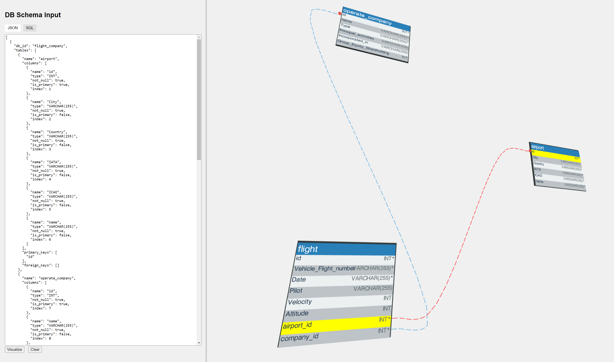

# DBVisualize-3D

**DBVisualize-3D** is a 3D visualization tool for relational database schemas, serving as an intuitive interface for visualizing database tables and their relationships. Users can input schemas in JSON or SQL format, dynamically generating an interactive 3D representation of the database. This web-based tool was created using HTML, JavaScript, and the Three.js library

<div align="center">
   
</div>

## Features

1. **3D Schema Visualization:**  
   DBVisualize-3D renders database tables and their relationships in a 3D space, allowing users to rotate and pan the view for navigating the schema structure.

2. **Schema Input Options:**  
   Users can input the database schema in either JSON or SQL format via the text box in the GUI. The application supports automatic both SQL and JSON for visualization.

3. **Hover-Based Key Highlighting:**  
   When hovering over a primary or foreign key within a table, the application visually highlights the connections between that key and its corresponding references (e.g., foreign keys pointing to the primary key of another table). This feature helps users trace and understand the relationships between tables in the schema.

4. **Interactive Table Focus:**  
   Users can left-click on a specific table to center the view on that table. The camera smoothly zooms in and adjusts its position, providing a detailed view of the selected table.

## Usage

1. **Launching the Program:**  
   Start the program by running:
   ```bash
   python3 -m http.server
   ```
   Then navigate to `http://localhost:8000/` in your browser.

2. **GUI Controls:**  
   - **Rotation:** Use the left mouse button to rotate the 3D view.
   - **Panning:** Use the right mouse button to pan across the scene.
   - **Table Focus:** Left-click on a table to zoom in and center the view on that table.
   - **Hover Key Highlighting:** Hover over any primary or foreign key to see visualized connections to related keys across tables.

3. **Schema Input:**  
   - Select between JSON and SQL tabs to input your database schema.
   - Paste your schema in the text area and click "Visualize" to generate the 3D model.
   - Use the "Clear" button if you need to reset the interface.

## Envisioning the Future: Innovations in 3D Database Management with Three.js

1. Real-time Data Flow: Implement animations that show real-time data flow between tables, helping users visualize how queries affect the database or how data moves through applications. This could be particularly useful for performance tuning and monitoring database operations.

2. Interactive Query Building: Develop a UI where users can construct queries by interacting with the 3D visualization. Dragging and connecting nodes can form joins, selecting nodes can be used to pick tables for queries, and so on. Make complex SQL queries more intuitively and less error-prone.

3. Data Exploration and Analysis: Create a 3D data dashboard where each point or shape represents data records. Users can explore large datasets by navigating through this space, using filters that adjust the visualization in real-time. For example, clustering data points by similarity or segmenting them by variables could help in identifying trends or outliers more effectively.

4. AR/VR Integration: By integrating these technologies, you could overlay the aformentioned applications into real-world environments, making the relationship between virtual database structures more intuitive.
